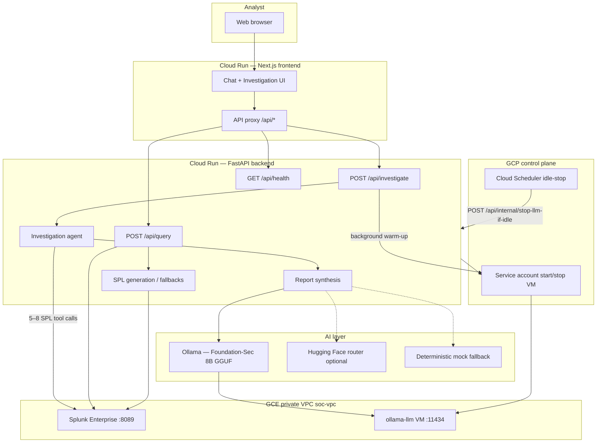

# SOC Copilot — Architecture

Architecture diagram for the Splunk AI Hackathon submission. Shows Splunk integration, AI/agent flow, and service data paths (local dev and GCP production).

## System diagram



## ASCII overview (local or cloud)

```
┌──────────────┐     HTTPS      ┌─────────────────────┐
│   Analyst    │ ─────────────► │  Next.js frontend   │
│   browser    │                │  (Cloud Run / :3000) │
└──────────────┘                └──────────┬──────────┘
                                           │ same-origin /api/*
                                           ▼
                                ┌─────────────────────┐
                                │  FastAPI backend    │
                                │  (Cloud Run :8080) │
                                │                     │
                                │  /api/query         │
                                │  /api/investigate   │
                                │  /api/health        │
                                └──────┬──────┬───────┘
                                       │      │
                         Splunk SDK    │      │  HTTP (VPC)
                         port 8089     │      ▼
                                       │   ┌──────────────────┐
                                       │   │ Ollama VM        │
                                       │   │ Foundation-Sec   │
                                       │   │ :11434           │
                                       │   └──────────────────┘
                                       ▼
                                ┌──────────────────┐
                                │ Splunk Enterprise │
                                │ index: botsv3     │
                                └──────────────────┘
```

## Component roles

| Component | Role |
|-----------|------|
| **Frontend** | Investigation-first UI: natural-language chat, query results, structured report (timeline, MITRE, remediation). Proxies API calls to backend via `BACKEND_URL`. |
| **Backend** | REST API, lazy Splunk client, deterministic multi-query investigation agent, LLM synthesis. |
| **Splunk** | Source of truth for security events (BOTS v3 or synthetic HEC data). All evidence comes from SPL executed via Splunk SDK. |
| **Ollama + Foundation-Sec** | Security-tuned 8B model (`fdtn-ai/Foundation-Sec` family via GGUF) for SPL generation (optional) and investigation report JSON synthesis. |
| **GCE LLM lifecycle** | Starts `ollama-llm` on demand; Cloud Scheduler stops VM when idle to minimize cost. |
| **VPC connector** | Lets Cloud Run reach private Splunk and Ollama IPs without public exposure. |

## Data flow — natural language query

1. User asks a question in the UI (e.g. “top sourcetypes in the last 24 hours”).
2. Frontend `POST /api/query` → backend.
3. Backend builds deterministic SPL (fast path) or LLM-generated SPL if `QUERY_USE_LLM_SPL=true`.
4. Backend runs SPL on Splunk via management API (`8089`).
5. JSON results returned to UI (SPL string + table rows).

## Data flow — autonomous investigation

1. User requests investigation (e.g. “Investigate IP 23.20.239.12”).
2. Backend starts **background Ollama VM warm-up** while Splunk queries run.
3. **Agent phase (deterministic):** up to 5 planned SPL queries (auth failures, successes, network, audit, raw evidence) with strict + broad fallbacks.
4. **Synthesis phase:** Foundation-Sec via Ollama produces structured JSON — severity, timeline, MITRE techniques, remediation steps. Falls back to rule-based mock report if LLM unavailable.
5. Frontend renders investigation report panels.

## AI integration summary

| Stage | AI usage |
|-------|----------|
| Intent / mode | Frontend detects query vs investigate from user text |
| SPL (query mode) | Deterministic templates by default; optional Ollama/HF for NL→SPL |
| Investigation queries | Deterministic agent plan (repeatable, auditable SPL) |
| Report synthesis | Ollama Foundation-Sec-8B-Instruct (primary) with mock fallback |
| Cost control | `AI_PROVIDER=mock` for zero LLM cost; GCE VM auto-stop when idle |

## Environment variables (production)

| Variable | Purpose |
|----------|---------|
| `SPLUNK_HOST` / `SPLUNK_PORT` / `SPLUNK_USER` / `SPLUNK_PASSWORD` | Splunk management API |
| `SPLUNK_INDEX` | Default index (e.g. `botsv3`) |
| `AI_PROVIDER` | `ollama`, `hf`, or `mock` |
| `OLLAMA_HOST` / `OLLAMA_PORT` | Private Ollama endpoint |
| `GCE_LLM_*` | VM name, zone, idle minutes |
| `BACKEND_URL` | Frontend proxy target (Cloud Run) |
| `CORS_ORIGINS` | Allowed browser origins |

## Live deployment (reference)

- Frontend: `https://soc-frontend-v5upnophmq-uc.a.run.app`
- Backend: `https://soc-backend-v5upnophmq-uc.a.run.app`

See `backend/.env.example` and `frontend/.env.local.example` for local development.
